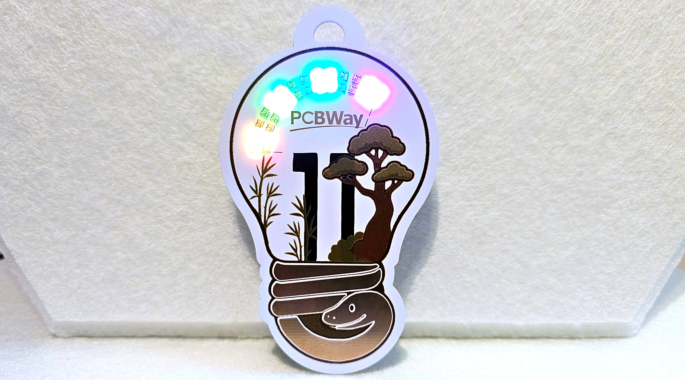

# Innovation Lightbulb Badge - Touch-Activated RGB LEDs

**🏆 My entry for the PCBWay 11th Badge Design Contest:** *"11 Years of Innovation and Beyond with PCBWay"*


## Table of Contents
- [Overview](#overview)
- [Features](#-features)
- [Hardware Requirements](#-hardware-requirements)
- [Getting Started](#-getting-started)
  - [Prerequisites](#prerequisites)
  - [Assembly Instructions](#assembly-instructions)
  - [Programming Setup](#programming-setup)
  - [Installation](#installation)
- [How It Works](#-how-it-works)
- [Configuration](#️-configuration)
- [PCB Design](#-pcb-design)
- [Performance](#-performance)
- [Troubleshooting](#️-troubleshooting)
- [Animation Modes](#-animation-modes)
- [Power Management](#-power-management)
- [Future Enhancements](#-future-enhancements)
- [Version History](#-version-history)
- [Contributing](#-contributing)
- [License](#-license)
- [Acknowledgments](#-acknowledgments)
- [Contact](#-contact)

## Overview

A creative lightbulb-shaped badge featuring touch-activated LED animations, combining PCB art with functional electronics. The badge celebrates PCBWay's 11-year journey with an interactive cog/gear LED pattern that comes to life when you touch the golden snake base.



*The completed Innovation Lightbulb Badge showcasing PCBWay's precision manufacturing. [Animation video here](https://youtu.be/jnBDUs-5CoI)*

## 🌟 Features

- **Touch Activation**: 28 cog/gear LEDs illuminate when touching the golden snake base
- **Multiple Animation Modes**: 5 different color patterns including rainbow, PCBWay green, fortune red, Australian colors, and white
- **Rotating Animation**: LED pattern simulates a turning gear/cog mechanism with configurable speed
- **Cultural Integration**: Year of the Wood Snake (2025) with bamboo and Chinese pine tree artwork
- **PCB Art**: Complex lightbulb cutout showcasing PCBWay's precision manufacturing and UV print capabilities
- **Low Power Design**: Battery-efficient with automatic sleep mode when not in use
- **Mode Cycling**: Automatically cycles through different color themes every 10 seconds of use
- **Interactive Badge**: Encourages human connection and conversation
- **Open Source**: Full KiCad files, firmware, and documentation shared with the maker community

## 🔧 Hardware Requirements

### Main Components
- **PCB**: Custom lightbulb-shaped design (order from PCBWay)
- **Microcontroller**: STM8S003F3P6 (20-pin TSSOP package)
- **LEDs**: 28x WS2812B addressable RGB LEDs (32 configured in firmware for animation wrapping)
- **Power**: LiPo battery (recommended: 503035 or 602535 with protection circuit)
- **Touch Sensor**: Golden snake pads (built into PCB design)

### Additional Components
See [/Hardware/BOM.csv](/Hardware/BOM.csv) for complete bill of materials including:
- Voltage regulators and power management ICs
- Capacitors and resistors
- Battery charging circuit components
- Programming header components

### Tools Required
- **Programming**: ST-Link v2 programmer (or compatible)
- **Soldering**: Hot air rework station, solder paste, flux
- **Assembly**: Fine-tip tweezers, magnifying glass
- **Power**: 3.3-5V power supply or LiPo battery

## 🚀 Getting Started

### Prerequisites

#### Software Requirements
- **Arduino IDE 2.0** or later
- **STM8 Arduino Core**: Add `https://github.com/akashkapashia/stm8_arduino/raw/master/package_sduino_stm8_index.json` to Board Manager URLs
- **ST-Link Drivers**: Install ST-Link v2 drivers for your operating system

#### Hardware Requirements
- ST-Link v2 programmer
- 4-wire connection: RST, GND, SWIM, 5V
- Power source (battery or bench supply)

### Assembly Instructions

#### Ordering PCB from PCBWay

##### Option 1 - KiCad Plugin (Recommended)
1. Download the complete `/Hardware/KiCad Files/` folder
2. Open `PCBWay_11th_Design_Contest.kicad_pro` in KiCad 9 or later
3. Use the PCBWay plugin to order directly from KiCad
4. Select UV printing option for the artwork layers

##### Option 2 - Manual Gerber Upload
1. Visit [PCBWay.com](https://www.pcbway.com)
2. Upload [/Hardware/Gerbers.zip](/Hardware/Gerbers.zip)
3. **Important**: Request UV printing for the artistic layers
4. Optional: Upload [/Hardware/BOM.csv](/Hardware/BOM.csv) and [/Hardware/Centroid.pos](/Hardware/Centroid.pos) for assembly service

##### Option 3 - Shared Project
Order from the [PCBWay Shared Projects Page](https://www.pcbway.com/project/shareproject/Innovation_Lightbulb_Badge_Touch_Activated_LED_Controller_d56364aa.html)

#### Soldering Process

**⚠️ Important Soldering Order:**
1. **Front LEDs First**: Apply solder paste and reflow the 28 WS2812B LEDs on the front
2. **Back SMD Components**: Apply solder paste and reflow all SMD components on the back
3. **Edge Components**: Use hot air gun for edge-mounted components (decoupling capacitors, if used)

#### Key Soldering Notes
- **LED Capacitors**: Optional but recommended for stable operation
- **R4 (0Ω Resistor)**: Can be used to force-enable LEDs for testing (bypasses touch sensor)
- **Programming Pads**: Ensure clean connections for reliable programming

### Programming Setup

#### Connection Diagram
```
ST-Link v2   →    Badge Programming Pads
-----------         ----------------------
/5V          →     5V  (marked with [])
GND          →     GND (marked with ())
SWIM         →     SWIM (marked with ())
NRST         →     RST (marked with ()))
```

#### Programming Pad Layout
```
Top of bulb shape

( ) RST    - Reset pin
( ) GND    - Ground
( ) SWIM   - Single Wire Interface Module
[ ] 5V     - Power supply (square pad)

Bottom of bulb / thread
```

### Installation

#### Method 1 - Arduino IDE (Recommended for Development)
1. **Clone the repository:**
   ```bash
   git clone https://github.com/platima/PCBWay-11th-Design-Contest.git
   cd PCBWay-11th-Design-Contest
   ```

2. **Install STM8 Arduino Core:**
   - Open Arduino IDE
   - Go to File → Preferences
   - Add board manager URL: `https://github.com/akashkapashia/stm8_arduino/raw/master/package_sduino_stm8_index.json`
   - Go to Tools → Board → Board Manager
   - Search for "STM8" and install the package

3. **Configure Board Settings:**
   - Board: "STM8S103F3"

4. **Upload Firmware:**
   - Open `Firmware/firmware.ino`
   - Connect ST-Link to programming pads (or hold in place)
   - Click Upload

#### Method 2 - Pre-compiled Hex File (Quick Start)
1. **Download and extract:** [firmware.ino.hex.zip](firmware.ino.hex.zip)
2. **Flash using stm8flash:**
   ```bash
   stm8flash -c stlinkv2 -p stm8s003f3 -w firmware.ino.hex
   ```

## 🎨 How It Works

### System Architecture

The badge operates in two distinct modes based on touch sensor input:

#### 1. Standby Mode (Power Saving)
- **All LEDs Off**: Conserves battery power
- **Touch Monitoring**: ADC continuously samples the golden snake pads
- **Low Power**: Minimal current draw for extended battery life
- **Wake-up Ready**: Instantly responds to touch detection (150ms)

#### 2. Active Mode (Animation Running)
- **Touch Detected**: ADC reading exceeds 800mV threshold
- **LED Animation**: Cog/gear pattern with rotating effect
- **Mode Cycling**: Automatically changes color themes every 10 seconds
- **Continuous Operation**: Runs until touch is no longer detected

#### 3. Touch Sensor Technology
- **Resistive Touch**: Uses skin conductivity to detect finger presence
- **Golden Snake Pads**: Artistic PCB traces serve as touch electrodes
- **ADC Monitoring**: STM8's built-in ADC on PD5 measures voltage changes
- **Threshold Detection**: 800mV threshold provides reliable touch detection

#### 4. LED Animation System
- **Cog/Gear Pattern**: 28 LEDs arranged in 14×2 tooth configuration
- **Rotating Effect**: Pattern shifts by 2 LEDs every 200ms
- **Color Modes**: 5 different themes with smooth transitions
- **Modular Design**: 32 LEDs configured in firmware for seamless wrapping

## ⚙️ Configuration

### Animation Timing
```c
#define ANIMATION_DELAY 200     // Animation speed (200ms = 5 FPS)
#define MODE_CHANGE_MS  10000   // Mode change interval (10 seconds)
```

### Cog Pattern Settings
```c
#define TOOTH_SIZE      4       // LEDs per color segment
#define TOOTH_GAP       4       // Gap between segments  
#define SHIFT_AMOUNT    2       // Animation shift speed (LEDs per frame)
#define N_LEDS          32      // Total LEDs (28 physical + 4 for wrapping)
```

### Touch Sensitivity
```c
#define TOUCH_THRESHOLD_MV 800  // Touch threshold (800mV)
#define ADC_VREF_MV     4100    // Reference voltage (4.1V)
#define ADC_RESOLUTION  1023    // 10-bit ADC resolution
```

### Visual Settings
```c
#define BRIGHTNESS      64      // LED brightness (0-255, set to 25%)
```

## 🎨 Animation Modes

The badge features 5 distinct animation modes that cycle automatically:

### 1. Rainbow Mode (`MODE_RAINBOW`) - Default
- **Colors**: Full spectrum rainbow cycling
- **Pattern**: Each LED position gets a different hue
- **Effect**: Creates a vibrant, eye-catching display
- **Use Case**: General demonstration and attraction

### 2. PCBWay Mode (`MODE_PCBWAY`)
- **Colors**: PCBWay signature green (RGB: 17, 167, 59)
- **Pattern**: Solid green cog rotation
- **Effect**: Brand-themed animation
- **Use Case**: PCBWay events and demonstrations

### 3. Fortune Mode (`MODE_FORTUNE`)
- **Colors**: Traditional Chinese red
- **Pattern**: Solid red cog rotation
- **Effect**: Cultural significance for good fortune
- **Use Case**: Chinese New Year, cultural events

### 4. Australia Mode (`MODE_AUSTRALIA`)
- **Colors**: Green and gold alternating
- **Pattern**: Alternating national colors
- **Effect**: Patriotic themed display
- **Use Case**: Australian events (customizable for other countries)

### 5. White Mode (`MODE_WHITE`)
- **Colors**: Pure white
- **Pattern**: Clean, bright white cog
- **Effect**: Professional, elegant appearance
- **Use Case**: Formal events, demonstrations

## ⚡ Power Management

### Battery Specifications
- **Recommended**: 503035 (500mAh) or 602535 (600mAh) LiPo
- **Voltage**: 3.7V nominal (3.0V - 4.2V range)
- **Protection**: Built-in PCM (Protection Circuit Module) required

### Power Consumption
- **Standby Mode**: <1mA (touch sensor monitoring only)
- **Active Mode**: ~200mA (all LEDs at 25% brightness)
- **Battery Life**: 
  - Standby: Several days
  - Continuous use: 2-3 hours
  - Typical use (intermittent): 8-12 hours

### Charging
- Use external charger such as [LiPo Charger Module (Basic)](https://shop.plati.ma/products/lipo-charger-module)

## 🔨 PCB Design

### Design Features
- **Artistic Shape**: Lightbulb cutout showcasing PCB manufacturing precision
- **LED Layout**: 28 WS2812B LEDs arranged in perfect cog/gear pattern
- **Touch Pads**: Golden snake design serves as capacitive touch sensor
- **Cultural Elements**: Year of the Wood Snake 2025 artwork
- **Functional Art**: UV printing demonstrates PCBWay's advanced capabilities

### Technical Specifications
- **Dimensions**: 58.74mm wide, 98.5mm tall
- **Layers**: 2-layer PCB with artistic copper pours
- **Thickness**: 1.2-1.6mm standard PCB thickness (FR4)
- **Surface Finish**: ENIG for golden appearance, else HASL
- **UV Printing**: Multi-color artwork on solder mask

### Programming Interface
- **Connector**: 4-pin programming header
- **Layout**: RST, GND, SWIM, 5V
- **Access**: Easily accessible on PCB back
- **Protection**: Test points for reliable connection

## 📈 Performance

### Response Characteristics
- **Touch Response**: <50ms from touch to LED activation
- **Animation Frame Rate**: 5 FPS (200ms per frame)
- **Color Accuracy**: 24-bit RGB with gamma correction
- **Power Efficiency**: >99% idle time power savings

### Environmental Specifications
- **Operating Temperature**: -10°C to +60°C
- **Storage Temperature**: -20°C to +80°C
- **Humidity**: 0-95% non-condensing
- **Vibration**: Suitable for badge/wearable use

### Recommendations
- **Battery**: Use velcro or similar adhesive to attach LiPo to back of PCB 

## 🛠️ Troubleshooting

### LED Issues

**Problem**: LEDs don't light up
**Solutions**:
- Check power supply voltage (minimum 3.5V for WS2812B)
- Verify solder connections on data line (PD4)
- Test with multimeter: 5V, GND, and data signal
- Ensure correct LED orientation (check datasheet pin 1)

**Problem**: Some LEDs don't work
**Solutions**:
- Check for cold solder joints on faulty LEDs
- Verify data chain continuity (WS2812B are daisy-chained)
- Test individual LED with reduced brightness
- Replace faulty LEDs if necessary

### Touch Sensor Issues

**Problem**: Touch sensor not responding
**Solutions**:
- Verify ADC configuration and PD5 connection
- Check threshold setting (try lowering `TOUCH_THRESHOLD_MV`)
- Clean golden snake pads (remove oxidation/contamination)
- Test with multimeter: voltage should change when touched
- Populate R4 (0Ω) to bypass touch sensor for testing

**Problem**: Touch sensor too sensitive
**Solutions**:
- Increase `TOUCH_THRESHOLD_MV` value
- Check for electrical noise affecting ADC
- Ensure proper grounding of the badge
- Add filtering capacitor if needed

### Programming Issues

**Problem**: Cannot program STM8
**Solutions**:
- Verify ST-Link connections (RST, GND, SWIM, 5V)
- Check ST-Link driver installation
- Ensure 5V power supply to badge during programming
- Try different programming cable/connection
- Reset STM8 before programming attempt

**Problem**: Code compiles but doesn't run
**Solutions**:
- Verify clock configuration (16MHz HSI)
- Check for infinite loops in initialization
- Add debug outputs to identify where code stops
- Verify all peripheral configurations

### Animation Issues

**Problem**: Animation stuttering or irregular
**Solutions**:
- Reduce `ANIMATION_DELAY` for smoother motion
- Check power supply stability (use oscilloscope)
- Verify timing calculations in animation code
- Ensure adequate power supply current capability

**Problem**: Wrong colors or color order
**Solutions**:
- Verify `COLOR_ORDER` setting (should be `grb` for WS2812B)
- Check LED manufacturer specifications
- Test with simple solid colors first
- Verify RGB color calculations in mode functions

## 🚧 Future Enhancements

### Community Contributions
- [ ] **Pattern Library**: User-submitted animation patterns
- [ ] **3D Printed Case**: Protective housing with lanyard attachment
- [ ] **Alternative Themes**: Country-specific color schemes
- [ ] **Educational Modules**: Programming tutorials and exercises
- [ ] **Hardware Variants**: Different LED counts and arrangements

### Advanced Features
- [ ] **Battery Monitoring**: Visual battery level indication
- [ ] **Event Modes**: Special patterns for holidays and events
- [ ] **Diagnostic Mode**: Self-test and troubleshooting features

## 📋 Version History

### Version 3.0 (Current - June 2025)
- ✅ Touch sensor functionality with ADC-based detection
- ✅ Five animation modes with automatic cycling
- ✅ Low-power sleep mode implementation
- ✅ Optimized cog/gear animation with smooth rotation
- ✅ Battery-efficient operation with wake-on-touch
- ✅ Complete STM8 Arduino IDE integration

### Version 2.0 (Development)
- ✅ STM8 microcontroller port completion
- ✅ WS2812B LED driver optimization
- ✅ Basic animation patterns implementation
- ✅ PCB design refinement and testing

### Version 1.0 (Prototype)
- ✅ Initial WS2812 control implementation
- ✅ Basic LED functions and color control
- ✅ Proof-of-concept hardware design

## 🤝 Contributing

This project is part of the PCBWay 11th Design Contest and is open source for the maker community!

### How to Contribute
1. **Fork the repository** on GitHub
2. **Create a feature branch** (`git checkout -b feature/amazing-feature`)
3. **Make your changes** with clear commit messages
4. **Test thoroughly** on actual hardware if possible
5. **Submit a pull request** with detailed description

### Contribution Guidelines
- **Code Style**: Follow existing Arduino/C++ conventions
- **Documentation**: Update README and code comments
- **Testing**: Verify changes don't break existing functionality
- **Hardware**: Test on actual badge hardware when possible

### Areas for Contribution
- **New Animation Modes**: Creative LED patterns and effects
- **Power Optimization**: Extend battery life further
- **Code Optimization**: Improve performance and memory usage
- **Documentation**: Tutorials, guides, and examples
- **Hardware Variants**: Alternative designs and improvements

## 📄 License

This project is licensed under the MIT License - see the [LICENSE](LICENSE) file for details.

### License Summary
- ✅ Commercial use permitted
- ✅ Modification and distribution allowed
- ✅ Private use encouraged
- ❌ No warranty provided
- 📝 License and copyright notice required

## 🙏 Acknowledgments

### Special Thanks
- **PCBWay** for hosting the 11th Design Contest and providing exceptional PCB manufacturing services
- **akashkapashia** for maintaining and improving the STM8 Arduino core library
- **ctxz** for the excellent TinyWS2812 library that makes WS2812B control seamless
- **STMicroelectronics** for the robust and affordable STM8 microcontroller platform
- **Adafruit** for pioneering WS2812 integration and providing extensive documentation
- **Wifey** for her patience with my stress, design and symbolism input, and feedback

### Community Support
- **EEVblog Forum** for embedded systems design discussions
- **Arduino Community** for programming support and examples  
- **KiCad Community** for PCB design tools and libraries
- **GitHub Contributors** for code reviews and improvements
- **Maker Community** for inspiration and creative ideas

### Technical Resources
- **STM8 Reference Manual** for comprehensive hardware documentation
- **WS2812B Datasheet** for LED timing and electrical specifications
- **PCB Manufacturing Guidelines** from PCBWay for design optimization
- **Embedded Systems Tutorials** for low-power design techniques

## 📞 Contact

### Project Information
- **GitHub Repository**: [PCBWay-11th-Design-Contest](https://github.com/platima/PCBWay-11th-Design-Contest)
- **Author**: [@platima](https://github.com/platima) (PlatimaTinkers)
- **Contest**: PCBWay 11th Badge Design Contest 2025
- **Theme**: "11 Years of Innovation and Beyond with PCBWay"

### Support and Questions
- **Issues**: [GitHub Issues](https://github.com/platima/PCBWay-11th-Design-Contest/issues)
- **Discussions**: [GitHub Discussions](https://github.com/platima/PCBWay-11th-Design-Contest/discussions)
- **Email**: [Contact through GitHub profile]

### Related Links
- **PCBWay Contest**: [Official Contest Page](https://www.pcbway.com/blog/News/PCBWay_11th_Badge_Design_Contest_7ac30a70.html)
- **PCBWay Shared Project**: [Direct Order Link](https://www.pcbway.com/project/shareproject/Innovation_Lightbulb_Badge_Touch_Activated_LED_Controller_d56364aa.html)
- **STM8 Arduino Core**: [akashkapashia/stm8_arduino](https://github.com/akashkapashia/stm8_arduino)
- **TinyWS2812 Library**: [ctxz/TinyWS2812](https://github.com/ctxz/TinyWS2812)

---

**🏆 PCBWay 11th Design Contest Entry**

*Showcasing innovative PCB design with practical embedded systems implementation*

**🐍 Year of the Wood Snake 2025** - *Celebrating innovation, creativity, and the maker spirit*

#Platima #NeoPixel #WS2812 #STM8 #Maker #Arduino #PCBWay #PCBWay11BadgeContest
